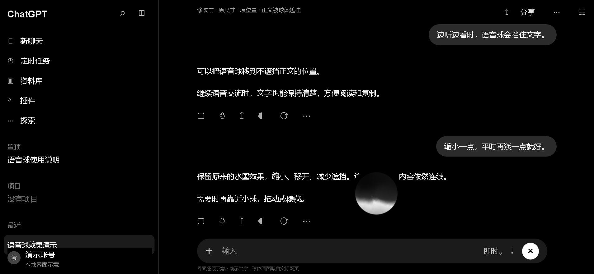
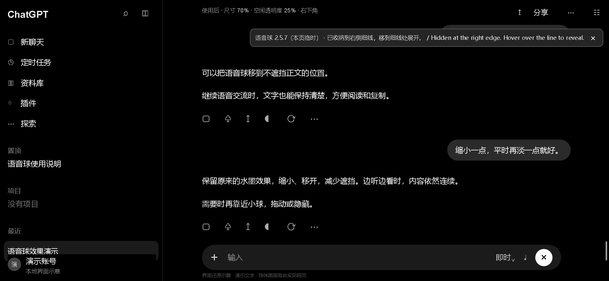
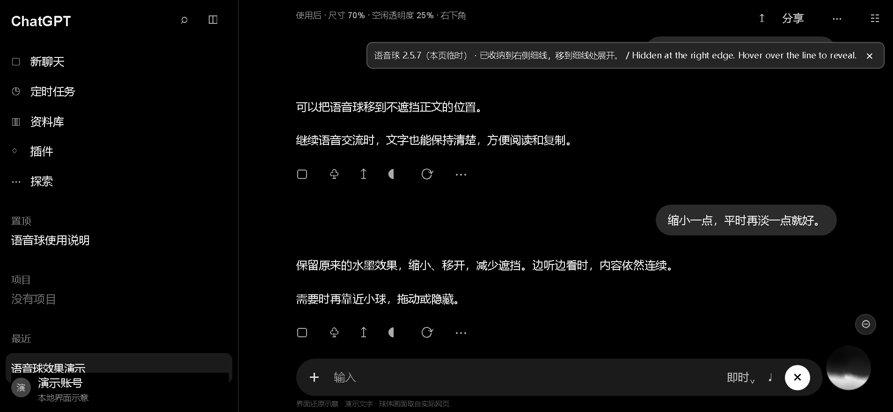

# ChatGPT 简约语音球 · Minimal Voice Orb

**ChatGPT 网页语音球挡字？缩小、直接拖动球体、自动变淡，自动贴边收纳，鼠标移到边缘即可展开。**

[**安装 / 下载完整脚本**](https://raw.githubusercontent.com/00007-ym/chatgpt-voice-orb/refs/heads/main/chatgpt-voice-orb.user.js) · [English](#english)

## 2.5.7 更新

- 直接按住球体拖动，移除独立拖动按钮，位置仍会自动记忆。
- 去掉眼睛，使用黑白细线圆环；拖动圆环也能移动，轻点即可收纳，没有 Emoji。
- 启动约 3 秒后收纳到最近的左／右侧边缘，保留细线。悬停或点击细线展开，鼠标离开约 1.1 秒后收回；中英文提示收纳位置。
- 保留原球外观、70% 尺寸、25% 空闲透明度，以及两组隐藏快捷键。

## 前后对比

| 修改前 | 使用后（贴边收纳） |
| --- | --- |
|  |  |

图片为界面还原示意，使用演示文字。球体画面、原始尺寸与位置取自真实网页；使用后运行本仓库脚本，不含私人对话。实际效果随窗口和网页版本变化。

## 安装

1. 安装脚本猫或 Tampermonkey 用户脚本管理器。
2. 打开上方安装链接；若未出现安装界面，在管理器中新建普通脚本，将完整源码粘贴进去并保存。
3. 启用脚本，刷新 ChatGPT 网页，再开启语音模式。

**更新已有脚本时，全选替换旧代码，不要追加或复制 GitHub 差异页面；避免同时启用多个版本。** 混合新旧代码可能造成重复声明，导致整段脚本无法执行。

## 使用

| 功能 | 操作 |
| --- | --- |
| 移动 | 按住球体或圆环拖动；收纳时吸附最近的左／右侧并记忆高度 |
| 隐藏 | 鼠标离开自动收纳，或轻点圆环立即收纳 |
| 恢复 | 鼠标移到左／右侧细线，或点击细线 |
| 快捷键 | Alt+Shift+V 或 Ctrl+Shift+H |
| 自动淡化 | 空闲透明度 25%，悬停或拖动时恢复清晰 |
| 图标收起 | 球体显示时，鼠标离开约 1.5 秒后收起 |
| 恢复网页原样 | 停用脚本，再刷新 ChatGPT |

隐藏球体不会结束通话或关闭麦克风。快捷键可能与系统或其他扩展冲突，可使用图标操作。直接拖动需要球体区域接收鼠标，因此球体可见时不能穿透它选择下方文字；可先移开或隐藏球体。

## 常见问题

**语音球挡住文字，怎么移动？**
直接按住球体拖到空白处即可，无需寻找拖动按钮。

**安装后没有反应？**
开启语音后需要网页中存在悬浮球。脚本启动时右上角会出现版本状态，也可以在管理器菜单中重新显示状态。如果编辑器报重复声明，使用安装链接中的完整文件替换旧代码。

**会读取聊天或上传数据吗？**
脚本不读取聊天正文、不处理音频、不发送消息、不主动发起网络请求。仅保存位置；每次加载后都会自动收纳。

## 验证与限制

2.5.7 已通过脚本猫 1.4.0 的实际安装测试：在独立 Edge 配置与模拟 ChatGPT DOM 上验证了启动、缩放、贴边收纳与悬停展开、左右侧中英文引导、两组快捷键、圆环拖动、刷新后位置记忆、窗口缩放、清理还原及无页面异常。此测试不等于当前真实语音页面的完整验证。旧版本曾在真实 Edge 语音页面测试；Chrome 尚未单独实测。

通过稳定属性 data-testid="avatar-overlay-voice-orb" 定位，多个候选时不移动。ChatGPT 页面结构变化后可能需要更新。仅用于网页悬浮语音球，不适用于原生手机或桌面 App。非官方项目，与 OpenAI 无关联。

## English

ChatGPT Minimal Voice Orb is a userscript that moves, shrinks, fades or hides the floating ChatGPT web voice orb when it covers text.

**Version 2.5.7:** the orb docks at the nearest left or right edge after about 3 seconds. A thin line marks its position. Hover over or click the line to reveal; move away to tuck it back after about 1.1 seconds. Bilingual guidance tells you which edge to use. Drag the orb or the monochrome ring to move it; click the ring to tuck it away. No eye icon or emoji. Alt+Shift+V and Ctrl+Shift+H also toggle visibility. Scale is 70%; idle opacity is 25%. Dock side and height are saved locally.

Install ScriptCat or Tampermonkey, open the installation link above, enable the script, reload ChatGPT and start voice mode. When replacing an existing script, replace the entire source rather than appending code or copying a GitHub diff. Disable the script and reload to restore the original interface.

Hiding does not end voice or mute the microphone. Visible orb dragging intercepts pointer input within the orb; move or hide it to select text underneath. The script does not read conversations, process audio, send messages or initiate network requests.

Tested via a real ScriptCat 1.4.0 installation in an isolated Edge profile against simulated ChatGPT DOM. Current-version end-to-end testing on the live voice page and separate Chrome testing have not been completed. The script depends on the floating orb's DOM attribute and may need updates after website changes. Unofficial; not affiliated with OpenAI.
